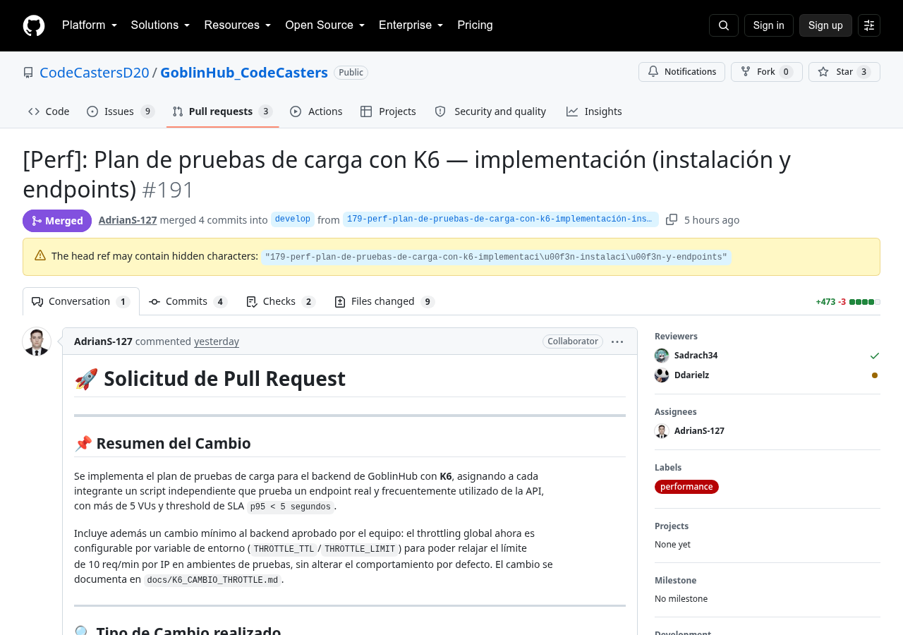
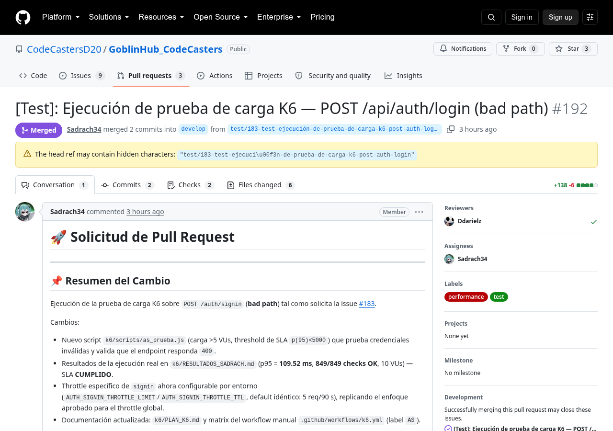
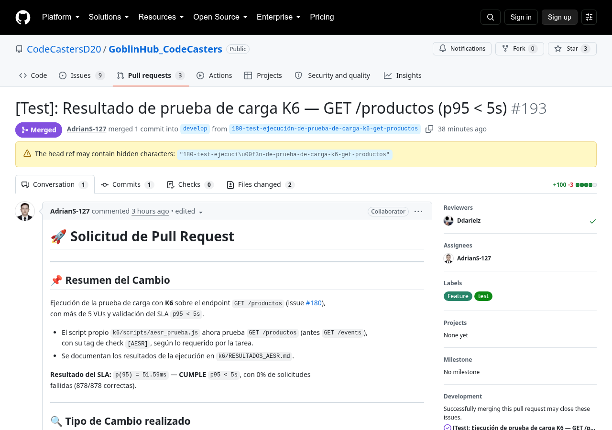
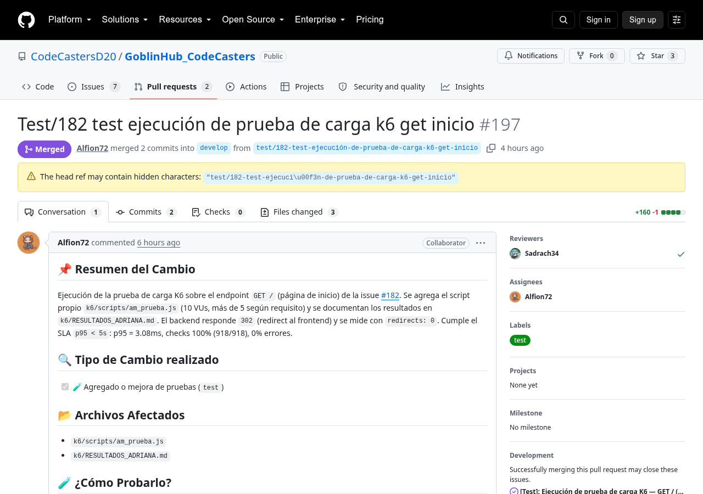
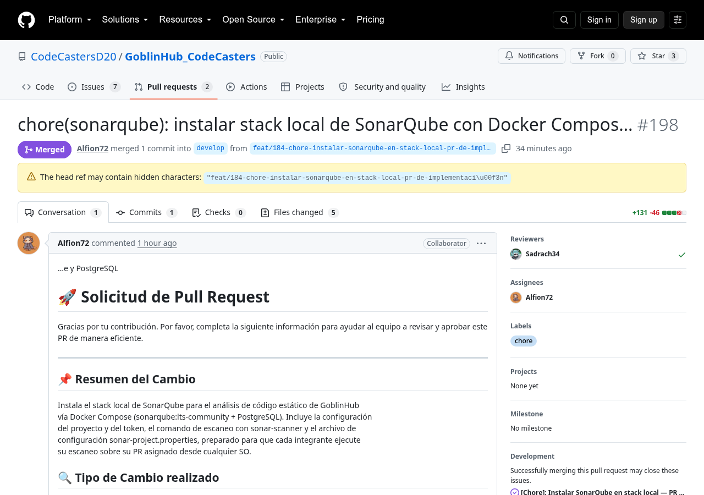
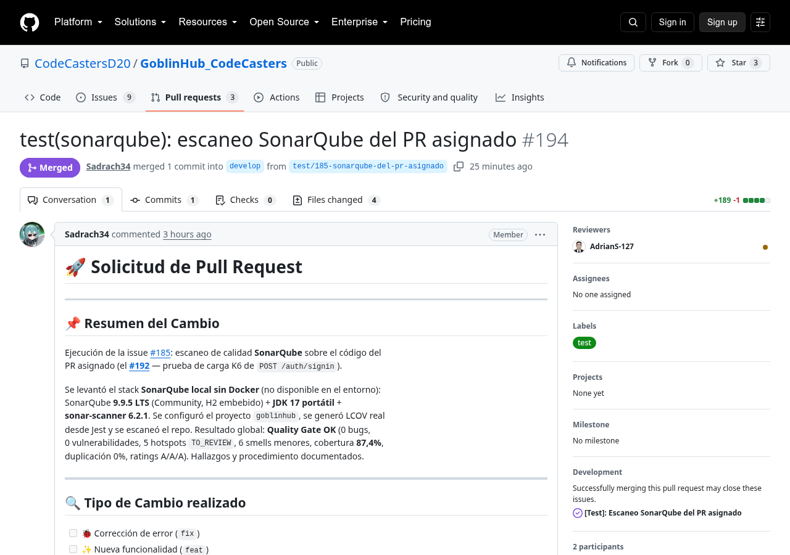
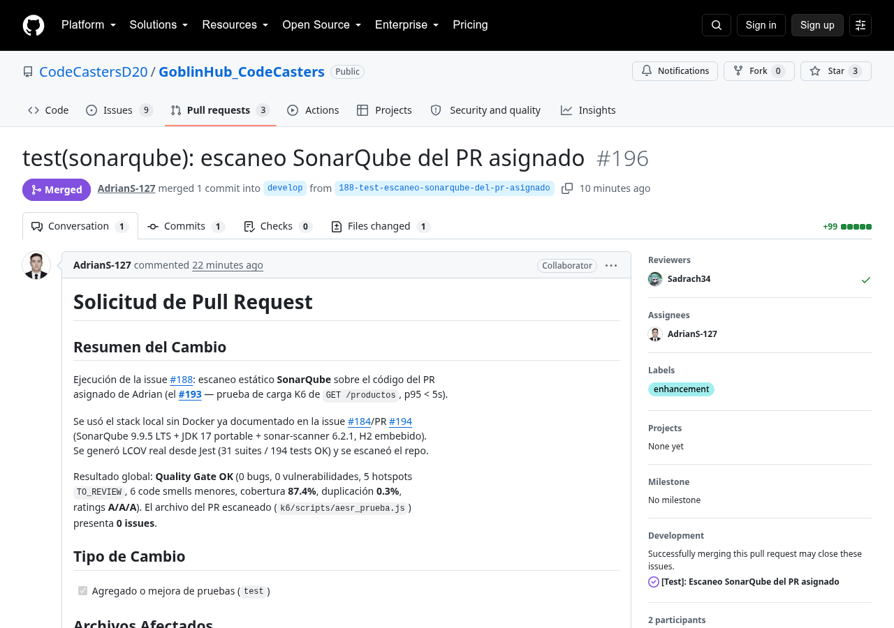
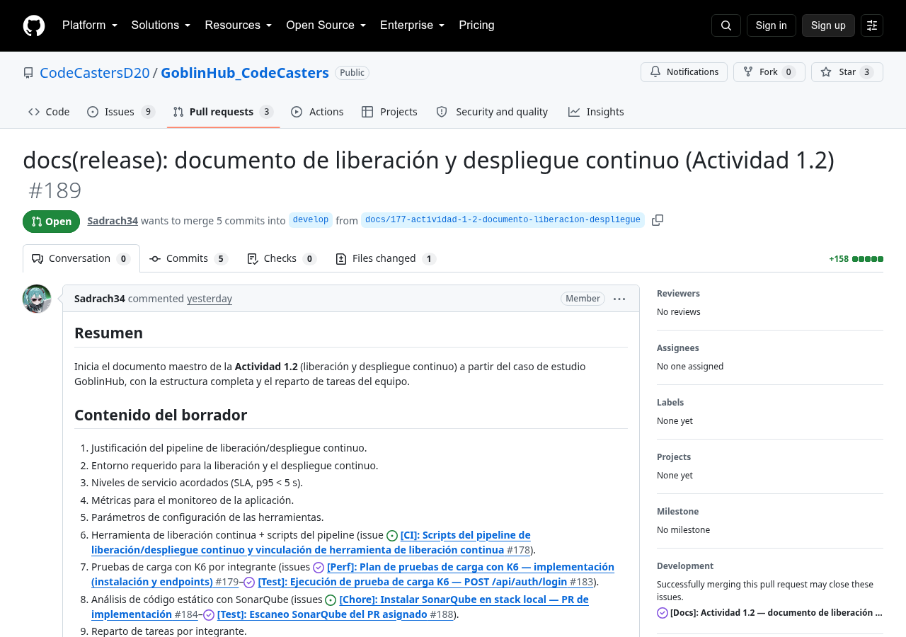

# Actividad 1.2 — Liberación, despliegue continuo y calidad de GoblinHub

> **Caso de estudio:** GoblinHub — plataforma web de gestión de una tienda y
> comunidad de videojuegos.
>
> **Repositorio:** <https://github.com/CodeCastersD20/GoblinHub_CodeCasters>
>
> Documento maestro de la **Actividad 1.2** (liberación y despliegue continuo).
> Se elabora por coordinación (issue [#177], PR [#189]) y consolida la
> evidencia de las issues **cerradas** del flujo de liberación, pruebas de
> carga (K6) y análisis de calidad (SonarQube) de los integrantes
> **Sadrach34**, **AdrianS-127** y **Alfion72**: issues #179, #180, #182, #183,
> #184, #185 y #188 (con #187 pendiente).

---

**UNIVERSIDAD TECNOLÓGICA DE HERMOSILLO, SONORA**

**TECNOLOGÍAS DE LA INFORMACIÓN — DESARROLLO Y GESTIÓN DE SOFTWARE MULTIPLATAFORMA**

Presentan:

- **Sadrach Juan Diego Garcia Flores (Sadrach34)**
- **Adrian Eduardo Santos Rosales (AdrianS-127)**
- **Jesus Adriana Martinez Trillas (Alfion72)**

---

# Mapa rápido de los módulos de la Actividad 1.2

| Módulo | En qué consiste | Issue | PR |
|---|---|---|---|
| **Pipeline de liberación y CD (coordinación)** | Justificación del flujo de trabajo (workflow) de liberación y despliegue continuo, entorno requerido, SLA y métricas de monitoreo | [#177] | [PR #189] |
| **Plan de pruebas de carga K6** | Instalación de K6 + selección de endpoints + scripts `iniciales_prueba.js` con > 5 VUs y SLA `p95 < 5 s` | [#179] | [PR #191] |
| **Ejecución de prueba de carga K6 (por integrante)** | Ejecución real: `POST /api/auth/login` (bad path), `GET /productos` y `GET /` (inicio), resultados en markdown + PR de ejecución | [#180], [#182], [#183] | [PR #193], [PR #197], [PR #192] |
| **Análisis estático SonarQube** | Instalación del stack local (Docker Compose + PostgreSQL) + escaneo del PR asignado de cada integrante con evidencia en markdown | [#184], [#185], [#188] | [PR #198], [PR #194], [PR #196] |

Capturas de los PRs: [Anexo A](#anexo-a-capturas-de-los-pull-requests).

---

# 1. Justificación del flujo de trabajo (pipeline) para la liberación y el despliegue continuo

GoblinHub adopta un pipeline de **liberación continua** (Continuous Delivery) y
**despliegue continuo** (Continuous Deployment) porque el caso de estudio exige
entregar funcionalidad nueva a producción de forma **repetible, trazable y con
calidad garantizada**. La justificación se apoya en cuatro pilares:

1. **Reducción del tiempo de puesta en producción y del riesgo humano.** El
   despliegue se automatiza (GitHub Actions + Render, Deploy Hooks y
   `HEALTHCHECK`), eliminando pasos manuales propensos a error.

2. **Calidad como puerta del pipeline.** No se libera ni despliega código que no
   pase: lint, `tsc --noEmit`, build, pruebas automatizadas (Jest/Vitest/
   Playwright), **pruebas de carga K6** (SLA `p95 < 5 s`) y **análisis
   estático SonarQube** (Quality Gate). Esto protege a `main`/`develop`.

3. **Trazabilidad release → entorno → pruebas → despliegue.** Cada liberación
   queda vinculada a una issue y un PR (`Closes #<id>`), se ejecutan las pruebas
   en el entorno de liberación y el despliegue se dispara y verifica
   automáticamente (rollback automático si falla el healthcheck).

4. **Entorno de liberación reproducible.** El stack se conteneriza
   (Dockerfile multi-stage `node:20-alpine`) y la infraestructura se define como
   código (Terraform, issue #165), garantizando que el entorno de liberación
   coincide con el de despliegue.

La integración continua real del proyecto ya está orquestada en
`.github/workflows/api.yml`, `web.yml` y `playwright.yml` (lint → type-check →
tests → build → E2E); la Actividad 1.2 aporta la **capa de liberación**: plan de
carga K6 (#179), ejecuciones por integrante (#180/#183), stack SonarQube y
escaneos (#185/#188) y el diseño de los scripts de release/despliegue (issue
#178, a cargo de @Ddarielz).

# 2. Entorno requerido para la liberación y el despliegue continuo

| Componente | Herramienta | Propósito |
|---|---|---|
| Control de versiones | Git + GitHub (ramas `main`/`develop`, PRs con revisión) | Flujo de trabajo por ramas y trazabilidad issue → PR |
| Integración continua | GitHub Actions (`api.yml`, `web.yml`, `playwright.yml`, `k6.yml`) | Lint, type-check, tests, build, E2E y pruebas de carga manuales |
| Liberación continua | GitHub Actions (workflow de release diseñado en #178) | Generar release y entorno de liberación |
| Contenedores | Docker (Dockerfile multi-stage `node:20-alpine`) + devcontainer/Codespaces | Entorno reproducible |
| Hosting / despliegue | Render (auto-deploy + Deploy Hooks) | Despliegue continuo con HTTPS automático |
| Pruebas de carga | K6 (issue #179, PR #191) | SLA `p95 < 5 s` |
| Análisis estático | SonarQube 9.9 LTS (stack local, Docker Compose + PostgreSQL, #184) | Calidad de código (Quality Gate) |
| Base de datos | PostgreSQL (Supabase) + Prisma | Persistencia |
| Caché de roles | Redis | Validación de roles en endpoints autenticados |

Entorno de pruebas para K6 en local:

- API corriendo en `http://localhost:3000`.
- Throttler global relajado **solo en ambiente de pruebas**:
  `THROTTLE_LIMIT=10000`, `AUTH_SIGNIN_THROTTLE_LIMIT=10000`,
  `AUTH_SIGNIN_THROTTLE_TTL=60000` (ver [K6_CAMBIO_THROTTLE.md]).
- BD con datos sembrados (eventos, productos, recompensas activas) para que los
  `GET` respondan `200`.
- Redis activo (endpoints autenticados).

# 3. Niveles de servicio acordados (SLA)

Los scripts del pipeline (issue #178) deben operar dentro de los siguientes
niveles de servicio pactados por el equipo:

| SLA | Criterio | Evidencia |
|---|---|---|
| **Tiempo de respuesta bajo carga** | `p95 < 5 s` en endpoints de uso frecuente | K6: [#179] plan, [#180]/[#182]/[#183] ejecuciones |
| **Disponibilidad del pipeline** | No se libera/despliega con pruebas fallidas | Puertas de CI (api.yml, web.yml, playwright.yml) |
| **Calidad de código** | Quality Gate SonarQube `OK`, sin bugs ni vulnerabilidades nuevas | [#184], [#185], [#188] |
| **Rollback** | Volver a la versión anterior si falla el healthcheck | `HEALTHCHECK` /health + Render |
| **Healthcheck** | API lista en `< 30 s` post-despliegue | Dockerfile multi-stage + Render |

Resultados verificados en esta actividad:

- K6 `POST /api/auth/login` (bad path): **p95 = 109.52 ms** → SLA cumplido
  ([k6/RESULTADOS_SADRACH.md]).
- K6 `GET /productos`: **p95 = 51.59 ms** → SLA cumplido
  ([k6/RESULTADOS_AESR.md]).
- K6 `GET /` (inicio): **p95 = 3.08 ms** → SLA cumplido
  ([k6/RESULTADOS_ADRIANA.md]).
- SonarQube (escaneos cerrados): **Quality Gate OK**, 0 bugs, 0 vulnerabilidades,
  cobertura **87.4%**, ratings **A/A/A** ([sonarqube/RESULTADOS_SADRACH.md],
  [sonarqube/RESULTADOS_ADRIAN.md]).

# 4. Métricas para el monitoreo de la aplicación

| Métrica | Fuente | Umbral acordado |
|---|---|---|
| `http_req_duration` (avg/p90/p95/p99) | K6 (`k6/scripts/*_prueba.js`) | `p95 < 5 s` |
| `http_reqs` (rendimiento) y `iterations` | K6 | Registro por integrante |
| `http_req_failed` y checks | K6 | `rate < 0.05` (excepto bad path) |
| Bugs / vulnerabilidades / code smells / hotspots | SonarQube | Quality Gate OK |
| Cobertura (`coverage`), duplicados (`duplicated_lines_density`) | SonarQube (lcov de Jest) | ≥ 80 % / 0 % |
| Estado del build/test | GitHub Actions | 100 % verde en `develop` |
| Healthcheck `/health` | Docker `HEALTHCHECK` + Render | ready en < 30 s |
| Errores HTTP 5xx/4xx | Checks K6 + logs JSON del backend | 0 errores en pico |

Resultados por integrante: `k6/RESULTADOS_*.md` y `sonarqube/RESULTADOS_*.md`.

# 5. Parámetros de configuración de las herramientas utilizadas

## 5.1 K6

Instalación documentada en [k6/PLAN_K6.md]:

- **Linux (apt):** `k6` vía repo de Grafana; **macOS (Homebrew):** `brew install k6`;
  **Windows:** binario oficial o `winget install k6`.
- **Variables de entorno:**

| Variable | Descripción | Default |
|---|---|---|
| `K6_BASE_URL` | URL base de la API bajo prueba | `http://localhost:3000` |
| `K6_TOKEN` | `access_token` JWT (solo script autenticado) | *(requerido sin default)* |

- **Configuración de carga común** (> 5 VUs) y **threshold SLA**:

```javascript
export const options = {
  stages: [
    { duration: '30s', target: 10 },
    { duration: '1m', target: 10 },
    { duration: '30s', target: 0 },
  ],
  thresholds: {
    http_req_duration: ['p(95)<5000'], // SLA p95 < 5 s
    http_req_failed: ['rate<0.05'],
  },
};
```

## 5.2 Throttling del backend (ajustado para carga)

Cambio mínimo aprobado ([docs/K6_CAMBIO_THROTTLE.md]): el `ThrottlerModule` del
API deja de estar hardcodeado y se lee del entorno, **sin cambiar el default**
(10 req/min por IP). Solo en ambiente de pruebas se relaja:

```dotenv
THROTTLE_TTL=60000
THROTTLE_LIMIT=10000
AUTH_SIGNIN_THROTTLE_LIMIT=10000
AUTH_SIGNIN_THROTTLE_TTL=60000
```

## 5.3 SonarQube (stack local — Docker Compose + PostgreSQL)

El stack local se instaló oficialmente con **Docker Compose + PostgreSQL**
(issue #184, PR #198): imágenes `sonarqube:lts-community` (SonarQube 9.9) y
`postgres:15`, con `sonar-scanner` 6.x (v7+ no es compatible con SonarQube 9.9).
Guía completa en [sonarqube/README.md] (incluye `docker-compose.yml`,
[sonarqube/.env.example]).

> Histórico: los primeros escaneos (#185, #188) usaron una variante **sin
> Docker** (Community LTS 9.9.5 + JDK 17 portable + H2 embebido); la instalación
> oficial mediante Compose la aportó @Alfion72 en la #184/PR #198 y es la
> recomendada para los escaneos pendientes.

Configuración del proyecto ([sonarqube/sonar-project.properties]):

```properties
sonar.projectKey=goblinhub
sonar.projectName=GoblinHub
sonar.sources=.
sonar.exclusions=**/node_modules/**,**/dist/**,**/coverage/**,**/*.spec.ts,**/*.test.ts,**/*.test.tsx,**/test/**,**/e2e/**,**/backups/**,**/prisma/**,**/playwright-report/**
sonar.javascript.lcov.reportPaths=/tmp/opencode/sonar/lcov/lcov.info
```

Escaneo:

```bash
sonar-scanner -Dsonar.host.url=http://localhost:9000 -Dsonar.login=$TOKEN \
  -Dproject.settings=sonarqube/sonar-project.properties
```

## 5.4 CI/CD

- Flujos existentes: `api.yml`, `web.yml`, `playwright.yml` (gate automáticos en
  `push`/`pull_request` a `main`/`develop`).
- **[.github/workflows/k6.yml]:** workflow **manual** (`workflow_dispatch`) que
  ejecuta los 5 scripts vía matrix (`AESR`, `EDAA`, `JAMT`, `SJDF`, `AS`) con
  `grafana/k6-action@v0.3.1`. Las cargas de K6 **no** se incorporan a
  pre-commit (no ralentizar el desarrollo local).

# 6. Herramienta de liberación continua vinculada con el entorno de despliegue

**Render** es la herramienta de despliegue continuo (auto-deploy desde el
repositorio / **Deploy Hooks**). El pipeline de **liberación continua** (GitHub
Actions, issue #178 — @Ddarielz) lo **complementa**: prepara la liberación y
**dispara y verifica** el despliegue. Entregables de la issue #178 (pendiente):

- `scripts/release/` — **generación del entorno de liberación** (build,
  artefactos/imagen, tag de release).
- `scripts/test/` — **ejecución de pruebas en el entorno de liberación**.
- `scripts/deploy/` — **generación del despliegue**: `curl <Deploy Hook de
  Render>` y verificación de `/health` post-despliegue.
- Workflow de **liberación continua**: build → tag/release → pruebas en el
  entorno de liberación → Deploy Hook de Render → healthcheck (rollback
  automático si falla).

El hosting de Render se despliega desde el repositorio con HTTPS automático
(Let's Encrypt / Google Trust Services), HTTP/2 y compresión Brotli, y el
contenedor expone `HEALTHCHECK` contra `/health`.

# 7. Pruebas de carga con K6

## 7.1 Plan (issue #179 — @AdrianS-127, PR #191, MERGED)

Se evaluaron **K6**, **JMeter** y **Apache Benchmark (`ab`)**. Se seleccionó
**K6** por scripting en JavaScript plano, métricas percentiladas integradas
(p95), thresholds declarativos (`p(95)<5000`), un solo binario y compatibilidad
con CI/CD ([k6/PLAN_K6.md]).

**PR de implementación** ([PR #191]): comandos de instalación (apt/brew/
binario/winget), variables de entorno, precondiciones, endpoints y la
configuración de carga común. Incluye además el ajuste de throttling
([docs/K6_CAMBIO_THROTTLE.md]), las variables `AUTH_SIGNIN_*` y el workflow
[.github/workflows/k6.yml].

## 7.2 Ejecuciones por integrante (issues cerradas)

| Issue | Integrante | Script (`iniciales_prueba.js`) | Endpoint | VUs | p95 | Resultado | PR |
|---|---|---|---|---|---|---|---|---|
| [#180] | @AdrianS-127 | `k6/scripts/aesr_prueba.js` | `GET /productos` | 10 | **51.59 ms** | Cumple SLA | [PR #193] |
| [#182] | @Alfion72 | `k6/scripts/am_prueba.js` | `GET /` (inicio) | 10 | **3.08 ms** | Cumple SLA | [PR #197] |
| [#183] | @Sadrach34 | `k6/scripts/as_prueba.js` | `POST /api/auth/login` (bad path) | 10 | **109.52 ms** | Cumple SLA | [PR #192] |

### 7.2.1 [#183] — Sadrach: POST /api/auth/login (bad path)

- **Entorno:** API `http://localhost:3000`, k6 v2.2.0, throttling de pruebas
  (`THROTTLE_LIMIT=10000`, `AUTH_SIGNIN_THROTTLE_LIMIT=10000/60000`).
- **Carga:** 10 VUs — 30 s ramp-up → 60 s sostenido → 30 s ramp-down.
- **Resultados** (detalle en [k6/RESULTADOS_SADRACH.md]):

| Métrica | Valor |
|---|---|
| `http_reqs` | 849 (7.04/s) |
| `http_req_duration` avg | 85.5 ms |
| `http_req_duration` p(95) | **109.52 ms** |
| Checks (responde 400) | 849/849 (100 %) |
| `vus` | 1 mín / 10 máx |

```text
✓ threshold http_req_duration p(95) = 109.52 ms < 5000 ms   # CUMPLE SLA
```

> Nota: `http_req_failed` al 100 % es el **comportamiento esperado** de un bad
> path (todas las respuestas son 4xx); por eso el script no define threshold
> sobre esa métrica y usa como gate único el SLA `p(95)<5000`.

### 7.2.2 [#180] — Adrian: GET /productos

- **Entorno:** API `http://localhost:3000`, k6 v2.1.0, throttler global relajado
  (`THROTTLE_LIMIT=10000`).
- **Carga:** 10 VUs — 30 s ramp-up → 60 s sostenido → 30 s ramp-down.
- **Resultados** (detalle en [k6/RESULTADOS_AESR.md]):

| Métrica | Valor |
|---|---|
| `http_reqs` | 878 (7.28/s) |
| `http_req_duration` avg/min/med | 47.95 / 44.15 / 45.94 ms |
| `http_req_duration` p(95) | **51.59 ms** |
| `http_req_failed` | 0.00 % (0/878) |
| Checks (`[AESR] GET /productos responde 200`) | 878/878 (100 %) |
| `vus` | 10 mín / 10 máx |

```text
✓ http_req_duration p(95) = 51.59 ms < 5000 ms   # CUMPLE SLA
✓ http_req_failed rate = 0.00 % < 0.05
```

> Observación: en la primera ejecución (antes de relajar el throttler) el API
> respondió `429` (97.81 % fallos); tras `THROTTLE_LIMIT=10000` la prueba
> terminó con **0 % errores** y p95 **51.59 ms**, ~95× por debajo del SLA.

### 7.2.3 [#182] — Adriana: GET / (página de inicio)

- **Entorno:** API `http://localhost:3000`, k6 v2.2.0.
- **Carga:** 10 VUs — 30 s ramp-up → 60 s sostenido → 30 s ramp-down.
- **Detalle:** se usa `redirects: 0` porque `GET /` del backend responde `302`
  (redirect a `http://localhost:5173`); se mide la latencia del propio redirect
  sin seguir al frontend.
- **Resultados** (detalle en [k6/RESULTADOS_ADRIANA.md]):

| Métrica | Valor |
|---|---|
| `http_reqs` | 918 (7.61/s) |
| `http_req_duration` avg/min/med | 2.24 / 0 / 1.30 ms |
| `http_req_duration` p(95) | **3.08 ms** |
| `http_req_failed` | 0.00 % (0/918) |
| Checks (`[AM] GET / responde 302`) | 918/918 (100 %) |
| `vus` | 1 (mín) / 10 (máx) |

```text
✓ http_req_duration p(95) = 3.08 ms < 5000 ms   # CUMPLE SLA
```

> `GET /` se sirve a nivel de servidor Express (antes del router Nest), por lo
> que no fue afectado por el throttle global en esta prueba.

### 7.2.4 Issues de ejecución pendientes (resto del equipo)

| Issue | Integrante | Endpoint/script |
|---|---|---|
| [#181] | @Ddarielz | `GET /eventos` (`edaa_prueba.js`) |

Los scripts matriz ya están en `develop` ([.github/workflows/k6.yml],
[`k6/scripts/*.js`]) listos para su ejecución por cada integrante.

# 8. Análisis de código estático con SonarQube

## 8.1 Stack local (instalación)

La instalación oficial del stack se realizó con **Docker Compose + PostgreSQL**
(issue #184, PR #198): `sonarqube:lts-community` (SonarQube 9.9) + `postgres:15`
+ `sonar-scanner` 6.x. Guía completa de puesta en marcha, token/proyecto por
API, ejecución del escaneo y solución de problemas en [sonarqube/README.md].

> Los escaneos #185 y #188 usaron la variante **sin Docker** (Community LTS
> 9.9.5 + H2 + JDK 17 portable vía `SONAR_JAVA_PATH`), levantada antes de que se
> mergeara la instalación Compose (#184/PR #198).

## 8.2 Escaneos por integrante (issues cerradas)

| Issue | Integrante | PR escaneado | Artefacto | Resultado | PR |
|---|---|---|---|---|---|
| [#185] | @Sadrach34 | [PR #192] (K6 bad path) | [sonarqube/RESULTADOS_SADRACH.md] | Quality Gate **OK** | [PR #194] |
| [#188] | @AdrianS-127 | [PR #193] (K6 GET /productos) | [sonarqube/RESULTADOS_ADRIAN.md] | Quality Gate **OK** | [PR #196] |

### Métricas consolidadas (ambos escaneos)

| Métrica | Sadrach (#185) | Adrian (#188) |
|---|---|---|
| Quality Gate | **OK** | **OK** |
| Bugs | 0 | 0 |
| Vulnerabilidades | 0 | 0 |
| Security Hotspots | 5 (TO_REVIEW) | 5 (TO_REVIEW) |
| Code Smells | 6 | 6 |
| Cobertura | **87.4 %** | **87.4 %** |
| Duplicados | 0.0 % | 0.3 % |
| ncloc | 5 074 | 5 074 |
| Ratings | A / A / A | A / A / A |

Los 5 hotspots están `TO_REVIEW`: `S2068` en `k6/scripts/as_prueba.js` (falso
positivo: credencial inválida del bad path), 3 reglas de Terraform en
`infra/terraform/main.tf` y 1 del Dockerfile del frontend — ninguno del código
de los PRs escaneados. Los code smells son CSS (`css:S4667`, `css:S4666`) y una
regla de deprecación de ESLint (`javascript:S1874`), ninguno en los PRs.

## 8.3 Escaneos pendientes (resto del equipo)

| Issue | Integrante |
|---|---|
| [#186] | @Ddarielz |
| [#187] | @Alfion72 |

# 9. Reparto de tareas por integrante (issues de la Actividad 1.2)

| Integrante | GitHub | Issues (estado) |
|---|---|---|
| Sadrach Juan Diego Garcia Flores | @Sadrach34 | #177 (docs, coord. PR #189), #183 K6 (✅ PR #192), #185 Sonar (✅ PR #194) |
| Adrián Eduardo Santos Rosales | @AdrianS-127 | #179 plan K6 (✅ PR #191), #180 K6 (✅ PR #193), #188 Sonar (✅ PR #196) |
| Jesús Adriana Martínez Trillas | @Alfion72 | #182 K6 (✅ PR #197), #184 Sonar install (✅ PR #198), #187 Sonar (pendiente) |
| Erick Daniel Arvayo Aviles | @Ddarielz | #178 pipeline (abierta), #181 K6 (abierta), #186 Sonar (abierta) |

# 10. Trazabilidad de requisitos de la Actividad 1.2

| # | Requisito de la actividad | Entrega | Issue / PR |
|---|---|---|---|
| 1 | Documento: justificación del pipeline de liberación y despliegue continuo | Sección 1 | [#177] / [PR #189] |
| 2 | Entorno requerido para la liberación y el despliegue continuo | Sección 2 | [#177] / [PR #189] |
| 3 | Niveles de servicio acordados (SLA) | Sección 3 (p95 < 5 s) | [#180], [#182], [#183] |
| 4 | Métricas para el monitoreo de la aplicación | Sección 4 | [#180], [#182], [#183], [#185], [#188] |
| 5 | Parámetros de configuración de las herramientas utilizadas | Sección 5 | [k6/PLAN_K6.md], [sonarqube/README.md] |
| 6 | Configurar y vincular herramienta de liberación continua con entorno de despliegue | Deploy Hook de Render | #178 (diseño) |
| 7 | Scripts del flujo de trabajo (pipeline) | `scripts/` | #178 (diseño) |
| 8 | Scripts para la generación del entorno de liberación | `scripts/release/` | #178 (diseño) |
| 9 | Scripts para la ejecución de pruebas en el entorno de liberación | `scripts/test/` | #178 (diseño) |
| 10 | Scripts para la generación del despliegue | `scripts/deploy/` | #178 (diseño) |
| 11 | Pruebas de carga (K6; alternativas JMeter / `ab` evaluadas) | `k6/` | [#179] / [PR #191] |
| 12 | PR de implementación del plan K6 (comandos de instalación + endpoints) | [k6/PLAN_K6.md] | [#179] / [PR #191] |
| 13 | Una prueba por integrante, script `iniciales_prueba.js`, ≥ 1 endpoint, > 5 VUs, máx. métricas | `k6/scripts/*_prueba.js` | [#180] (✅), [#182] (✅), [#183] (✅), [#181] (pend.) |
| 14 | Commit de resultados en markdown + PR de ejecución de pruebas | `k6/RESULTADOS_*.md` | [#180] / [PR #193], [#182] / [PR #197], [#183] / [PR #192] |
| 15 | Uso en CI/CD (husky pre-commit o GitHub Actions) + screenshot por integrante (opcional) | [.github/workflows/k6.yml] | [#179], [#180], [#182], [#183] |
| 16 | Implementar SonarQube en stack local (PR con pasos markdown) | [sonarqube/README.md], [sonarqube/docker-compose.yml] | [#184] / [PR #198] (Docker Compose + PostgreSQL, @Alfion72) |
| 17 | Evidenciar resultados: escaneo de su PR por cada integrante | `sonarqube/RESULTADOS_*.md` | [#185] / [PR #194], [#188] / [PR #196], [#186]/[#187] (pend.) |

> **Cierre parcial:** las issues cerradas #179, #180, #182, #183, #184, #185 y
> #188 de los integrantes Sadrach34, AdrianS-127 y Alfion72 están consolidadas
> en este documento con sus capturas de PR (Anexo A). Cuando las issues abiertas
> del resto del equipo (#178, #181, #186, #187) se completen, se integrarán sus
> resultados y capturas y se generará el `.docx` final.

---

# Anexo A: Capturas de los Pull Requests

**PR #191 — Plan de pruebas de carga K6 (implementación)** ([#179])



**PR #192 — Ejecución K6 POST /api/auth/login** ([#183])



**PR #193 — Ejecución K6 GET /productos** ([#180])



**PR #197 — Ejecución K6 GET / (inicio)** ([#182])



**PR #198 — Instalación SonarQube (Docker Compose)** ([#184])



**PR #194 — Escaneo SonarQube (Sadrach)** ([#185])



**PR #196 — Escaneo SonarQube (Adrian)** ([#188])



**PR #189 — Este documento (coordinación)** ([#177])



# 11. Ligas de apoyo y material de referencia

- **k6 (Grafana):** <https://grafana.com/docs/k6/latest/> — instalación:
  <https://github.com/grafana/k6/releases>
- **JMeter (Apache):** <https://jmeter.apache.org/>
- **Apache Benchmark (`ab`):** <https://httpd.apache.org/docs/2.4/programs/ab.html>
- **SonarQube:** <https://www.sonarsource.com/products/sonarqube/> (~Community
  9.9 LTS)
- **sonar-scanner:** <https://docs.sonarsource.com/sonarqube/latest/analyzing-source-code/scanners/sonarscanner/>
- **Render (hosting/deploy hooks):** <https://render.com/docs/deploys>
- **GitHub Actions:** <https://docs.github.com/es/actions>
- **Repositorio del proyecto:**
  <https://github.com/CodeCastersD20/GoblinHub_CodeCasters>

[#177]: https://github.com/CodeCastersD20/GoblinHub_CodeCasters/issues/177
[#179]: https://github.com/CodeCastersD20/GoblinHub_CodeCasters/issues/179
[#180]: https://github.com/CodeCastersD20/GoblinHub_CodeCasters/issues/180
[#181]: https://github.com/CodeCastersD20/GoblinHub_CodeCasters/issues/181
[#182]: https://github.com/CodeCastersD20/GoblinHub_CodeCasters/issues/182
[#183]: https://github.com/CodeCastersD20/GoblinHub_CodeCasters/issues/183
[#184]: https://github.com/CodeCastersD20/GoblinHub_CodeCasters/issues/184
[#185]: https://github.com/CodeCastersD20/GoblinHub_CodeCasters/issues/185
[#188]: https://github.com/CodeCastersD20/GoblinHub_CodeCasters/issues/188
[PR #189]: https://github.com/CodeCastersD20/GoblinHub_CodeCasters/pull/189
[PR #191]: https://github.com/CodeCastersD20/GoblinHub_CodeCasters/pull/191
[PR #192]: https://github.com/CodeCastersD20/GoblinHub_CodeCasters/pull/192
[PR #193]: https://github.com/CodeCastersD20/GoblinHub_CodeCasters/pull/193
[PR #194]: https://github.com/CodeCastersD20/GoblinHub_CodeCasters/pull/194
[PR #196]: https://github.com/CodeCastersD20/GoblinHub_CodeCasters/pull/196
[PR #197]: https://github.com/CodeCastersD20/GoblinHub_CodeCasters/pull/197
[PR #198]: https://github.com/CodeCastersD20/GoblinHub_CodeCasters/pull/198
[k6/PLAN_K6.md]: ../k6/PLAN_K6.md
[k6/RESULTADOS_SADRACH.md]: ../k6/RESULTADOS_SADRACH.md
[k6/RESULTADOS_AESR.md]: ../k6/RESULTADOS_AESR.md
[k6/RESULTADOS_ADRIANA.md]: ../k6/RESULTADOS_ADRIANA.md
[docs/K6_CAMBIO_THROTTLE.md]: ../docs/K6_CAMBIO_THROTTLE.md
[.github/workflows/k6.yml]: ../.github/workflows/k6.yml
[sonarqube/README.md]: ../sonarqube/README.md
[sonarqube/.env.example]: ../sonarqube/.env.example
[sonarqube/docker-compose.yml]: ../sonarqube/docker-compose.yml
[sonarqube/RESULTADOS_SADRACH.md]: ../sonarqube/RESULTADOS_SADRACH.md
[sonarqube/RESULTADOS_ADRIAN.md]: ../sonarqube/RESULTADOS_ADRIAN.md
[sonarqube/sonar-project.properties]: ../sonarqube/sonar-project.properties