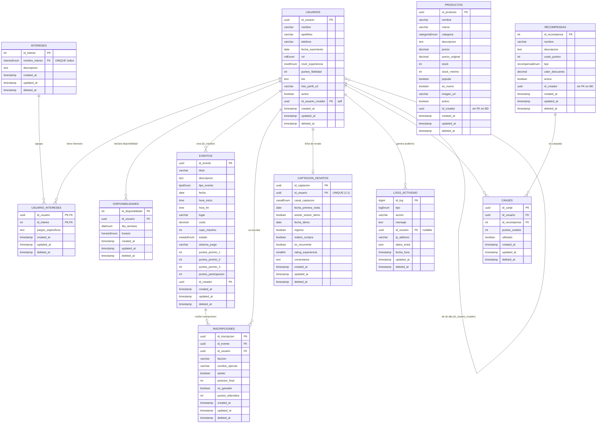

# Ingeniería inversa — Estado actual del sistema GoblinHub (CodeCasters)

> **Fecha de análisis:** 2026-09-11
> **Bases analizadas:** `develop` + rama activa `docs/154-ratificar-constitucion-spec-kit`
> **Método:** lectura del esquema Prisma y migraciones, Módulos/controladores/use-cases de NestJS, servicios, páginas y rutas de React, guards, documentación `docs/` e historial de ramas git.
> **Fuente de verdad del modelo:** `goblinhub-api/prisma/schema.prisma`

---

## 1. Resumen ejecutivo

GoblinHub es una plataforma fullstack (NestJS + Prisma/PostgreSQL + React/Vite + Supabase Auth/Storage) para la tienda *La Guarida del Goblin*. La ingeniería inversa arroja:

| Dimensión | Cantidad |
| --- | --- |
| Tablas de base de datos | **11** (todas versionadas en migraciones) |
| Enums | **11** |
| Módulos NestJS registrados | **8** (`events`, `logs`, `supabase`, `backup`, `rewards`, `products`, `upload`, `connect`) |
| Endpoints HTTP expuestos | **40** |
| Rutas de frontend | **~19** (10 públicas + 4 autenticadas + 5 admin) |
| Servicios de API del frontend | **6** |
| Ramas (locales + remotas) | **~35 locales / ~45 remotas** |

**Hallazgos principales**

- El núcleo operativo está consolidado y conectado: **usuarios, eventos, inscripciones (lectura), productos, logs, backups, uploads**.
- Existen **4 tablas sin ningún código de aplicación** (`intereses`, `usuario_intereses`, `disponibilidades`, `canjes`) y **`captacion_novatos` con uso solo agregado** (métricas).
- **No existe endpoint de inscripción** a eventos pese a que el frontend lo declara en `events.service.ts` (`.inscribirse()`) y la UI lo sugiere con el botón *Inscribirse*.
- La **gestión administrativa de productos y recompensas está sin conectar**: el backend expone CRUD completo, pero el frontend solo consume lectura de productos y no usa recompensas.
- El **concepto de puntos/canje (negocio de fidelidad) está sin implementar** a pesar de ser un pilar del README y la constitución.

---

## 2. Estado del repositorio

```
GoblinHub_CodeCasters/
├── goblinhub-api/        # NestJS + Prisma + Supabase (+ Redis)
├── goblinhub_web/        # React 19 + Vite (+ Playwright/Vitest)
├── docs/                 # Documentación técnica y auditorías
├── .specify/             # Spec Kit (constitución, plantillas, workflows)
└── AGENTS.md             # Reglas de equipo/flujo GitHub
```

**Módulos backend** (`goblinhub-api/src/modules/`)

| Módulo | Responsabilidad | Entidades que toca |
| --- | --- | --- |
| `supabase` (auth) | JWT local, registro/login, refresh, forgot/reset password, perfil + foto, administración de usuarios, RBAC | `usuarios`, `logs_actividad` |
| `events` | CRUD de eventos + scheduler de expiración (programado → en curso → finalizado) | `eventos` |
| `products` | CRUD de productos (soft-delete) | `productos` |
| `rewards` | CRUD de recompensas (soft-delete) | `recompensas` |
| `logs` | Lectura de logs + métricas de dashboard; interceptor global de auditoría | `logs_actividad`, `inscripciones`, `captacion_novatos` |
| `upload` | Subir/eliminar imágenes en Supabase Storage | — (storage) |
| `backup` | Respaldo/restauración de la BD (pg_dump) | — (BD) |
| `connect` | PrismaService (capa de datos) | — (ORM) |

---

## 3. Modelo de datos (Diagrama Entidad-Relación)

Generado a partir de `goblinhub-api/prisma/schema.prisma` (source of truth). Se incluyen los campos de negocio y claves; los timestamps (`created_at`, `updated_at`, `deleted_at`) se representan por compactación.



### 3.1 Enums de dominio

| Enum | Valores |
| --- | --- |
| `RolUsuario` | `admin`, `empleado`, `jugador` |
| `NivelExperiencia` | `novato`, `intermedio`, `veterano` |
| `TipoInteres` | `Wargames`, `Rol`, `Mesa`, `Pintura`, `TCG`, `Torneos` |
| `DiaDisponibilidad` | `lunes_viernes`, `sabados`, `domingos` |
| `HorarioDisponibilidad` | `tardes`, `noches` |
| `TipoEvento` | `torneo`, `iniciacion`, `taller`, `sesion_rol`, `especial` |
| `EstadoEvento` | `programado`, `en_curso`, `finalizado`, `cancelado` |
| `CategoriaProducto` | `wargames`, `rol`, `mesa`, `pintura`, `accesorios` |
| `CanalCaptacion` | `redes_sociales`, `recomendacion`, `web`, `evento`, `otro` |
| `TipoLog` | `success`, `info`, `warning`, `error` |
| `TipoRecompensa` | `descuento`, `producto_gratis`, `acceso_evento`, `otro` |

### 3.2 Claves, unicidad e índices

| Tabla | PK | Uniq/compuestas | Índices parciales (`deleted_at IS NULL`) |
| --- | --- | --- | --- |
| `usuarios` | `id_usuario` (uuid) | — | `idx_usuarios_creador` (id_usuario_creador) |
| `intereses` | `id_interes` | `nombre_interes` | — |
| `usuario_intereses` | `(id_usuario, id_interes)` | PK compuesta | `idx_usuario_intereses_interes` (id_interes) |
| `disponibilidades` | `id_disponibilidad` | — | `idx_disponibilidades_usuario` (id_usuario) |
| `eventos` | `id_evento` (uuid) | — | `idx_eventos_creador` (id_creador) |
| `inscripciones` | `id_inscripcion` (uuid) | `(id_evento, id_usuario)` | `idx_inscripciones_evento`, `idx_inscripciones_usuario` |
| `productos` | `id_producto` (uuid) | — | — |
| `captacion_novatos` | `id_captacion` (uuid) | `id_usuario` (1:1) | — |
| `logs_actividad` | `id_log` (bigint) | — | `idx_logs_usuario` (id_usuario) |
| `recompensas` | `id_recompensa` | — | — |
| `canjes` | `id_canje` (uuid) | — | `idx_canjes_usuario`, `idx_canjes_recompensa` |

> Los índices parciales (9 FK) se crearon en la migración `20260814064838_add_concurrent_indexes_for_fks` (PR `perf/135`).

### 3.3 Notas de diseño del modelo

- **Soft-delete como norma:** todas las tablas de negocio tienen `deleted_at` (alineado con el principio II de la Constitución).
- **`usuarios.email` y `password_hash` fueron eliminados** (migración `20260221021559_align_usuario_with_supabase_auth`); el email vive en **Supabase Auth**, no en la tabla de negocio. Consecuencia: `GET /auth/admin/users` devuelve `email: null` siempre.
- **`productos.id_creador` y `recompensas.id_creador` no declaran relación Prisma** → **no hay constraint FK** en la BD para esos campos.
- **Autorelación en `usuarios`** (`id_usuario_creador`) representa "usuario dado de alta por otro"; no hay vista de negocio que lo explote.
- Las FK con datos sensibles usan política de borrado: `Cascade` en agregaciones (inscripciones, intereses, canjes) y `SetNull` en `logs_actividad`.
- `eventos.hora_inicio/hora_fin` son `Time` (no timestamp), por lo que **el scheduler de expiración depende de `fecha` + `hora_inicio/hora_fin`** (histórico de bugs #37 con epoch 1970).

---

## 4. Trazabilidad del sistema

### 4.1 Mapa de endpoints (backend → entidades)

| Módulo | Verbo | Ruta | Guardas/Roles | Entidades |
| --- | --- | --- | --- | --- |
| `auth` | POST | `/auth/signin` | Pública (throttle) | Supabase Auth + `usuarios` |
| `auth` | POST | `/auth/signup` | Pública (throttle) | Supabase Auth + `usuarios` |
| `auth` | POST | `/auth/refresh-token` | Pública (throttle + guard refresh) | Supabase Auth |
| `auth` | GET | `/auth/profile` | **JWT** | `usuarios` |
| `auth` | GET | `/auth/me` | **JWT** | `usuarios` (+ rol) |
| `auth` | GET | `/auth/verify` | **JWT** | Supabase Auth |
| `auth` | POST | `/auth/forgot-password` | Pública (throttle) | Supabase Auth |
| `auth` | POST | `/auth/reset-password` | Pública (throttle) | Supabase Auth |
| `auth` | POST | `/auth/test/signin` | **JWT + admin** (bloqueado en prod) | `usuarios` |
| `auth` | PATCH | `/auth/me` | **JWT** | `usuarios` |
| `auth` | PUT | `/auth/me/foto` | **JWT** | `usuarios` + Storage |
| `auth` | DELETE | `/auth/me/foto` | **JWT** | `usuarios` + Storage |
| `auth` | GET | `/auth/admin/users` | **JWT + admin/empleado** | `usuarios` (+ `inscripciones` conteo) |
| `auth` | PATCH | `/auth/admin/users/:id` | **JWT + admin/empleado** | `usuarios` |
| `auth` | DELETE | `/auth/admin/users/:id` | **JWT + admin** | `usuarios` (soft-delete) |
| `events` | GET | `/events` (+`?name=`) | Pública | `eventos` |
| `events` | GET | `/events/:id` | Pública | `eventos` |
| `events` | POST | `/events` | **JWT + admin/empleado** | `eventos` |
| `events` | PUT | `/events/:id` | **JWT + admin/empleado** | `eventos` |
| `events` | DELETE | `/events/:id` | **JWT + admin** | `eventos` (soft-delete) |
| `productos` | GET | `/productos` | Pública | `productos` |
| `productos` | GET | `/productos/:id` | Pública | `productos` |
| `productos` | GET | `/productos/categoria/:categoria` | Pública | `productos` |
| `productos` | POST | `/productos` | **JWT + admin/empleado** | `productos` |
| `productos` | PUT | `/productos/:id` | **JWT + admin/empleado** | `productos` |
| `productos` | DELETE | `/productos/:id` | **JWT + admin** | `productos` (soft-delete) |
| `rewards` | GET | `/rewards` (+`?name=`) | Pública | `recompensas` |
| `rewards` | GET | `/rewards/:id` | Pública | `recompensas` |
| `rewards` | POST | `/rewards` | **JWT + admin/empleado** | `recompensas` |
| `rewards` | PATCH | `/rewards/:id` | **JWT + admin/empleado** | `recompensas` |
| `rewards` | DELETE | `/rewards/:id` | **JWT + admin** | `recompensas` (soft-delete) |
| `logs` | GET | `/logs/dashboard/metrics` | **JWT + admin** | `usuarios`, `productos`, `eventos`, `inscripciones`, `captacion_novatos` |
| `logs` | GET | `/logs/recent` | **JWT + admin** | `logs_actividad` |
| `logs` | GET | `/logs` | **JWT + admin** | `logs_actividad` |
| `logs` | GET | `/logs/:id` | **JWT + admin** | `logs_actividad` |
| `upload` | POST | `/upload` | **JWT + admin/empleado** | Storage |
| `upload` | DELETE | `/upload?url=` | **JWT + admin/empleado** | Storage |
| `backup` | GET | `/backup` | **JWT + admin** | BD |
| `backup` | POST | `/backup` | **JWT + admin** | BD |
| `backup` | POST | `/backup/restore` | **JWT + admin** | BD |

**Mecanismo global:** `ThrottlerGuard` global (10 req/min) + `ActivityLogInterceptor` global que registra la auditoría en `logs_actividad` (excepto lectura de logs) + Helmet/CORS por whitelist (`main.ts`).

### 4.2 Mapa frontend ↔ API

| Ruta (página) | Servicio(s) | Endpoints consumidos |
| --- | --- | --- |
| `/` (Home) | `events.service` + Google Maps | `GET /events` · Google Maps embed |
| `/eventos` (Calendario) | `events.service` | `GET /events` |
| `/eventos/:id` (EventoDetalle) | — | **sin llamada API (stub con `<h1>`)** |
| `/productos` | `products.service` | `GET /productos`, `GET /productos/categoria/:cat` |
| `/productos/:id` | `products.service` | `GET /productos/:id` |
| `/contacto` (aboutUs) | Google Maps | Maps |
| `/login` | `auth.service` | `POST /auth/signin`, `POST /auth/forgot-password` |
| `/register` (RegisterFlow) | `auth.service` | `POST /auth/signup` (pasos de intereses/disponibilidad **no persisten**) |
| `/reset-password` | `auth.service` | `POST /auth/reset-password` |
| `/confirm-account` | — | usa token de la URL (Supabase email) |
| `/perfil` | `auth.service` | `GET /auth/me`, `PATCH /auth/me`, `PUT /auth/me/foto`, `DELETE /auth/me/foto` |
| `/administration` y `/admin` | `reportes.service` | `GET /logs/dashboard/metrics` |
| `/admin/reportes` | `reportes.service` | `GET /logs/dashboard/metrics` |
| `/admin/logs` | `logs.service` + `useLogs` | `GET /logs` (paginado y filtrado) |
| `/admin/eventos` | `events.service` | `GET /events` (listado + delete) |
| `/admin/eventos/:id` (ver) | `events.service` | `GET /events/:id` |
| `/admin/eventos/nuevo` (form) | `events.service` | `POST /events` / `PUT /events/:id` |
| `/admin/usuarios` | `users-admin.service` | `GET /auth/admin/users` (búsqueda con debounce + filtro rol) |
| `/admin/novatos` | — | **sin llamada API (UI estática)** |
| páginas productos admin (crear/editar/listado) | — | **sin llamada API (UI estática)** |
| `EditarUsuario` (modal dentro de usuarios) | — | **sin persistencia (UI)** |

### 4.3 Matriz Entidad ↔ Implementación

Leyenda: ✅ implementado · ⚠️ parcial · ❌ sin implementar

| Entidad (tabla) | CRUD/uso backend | Endpoints | Frontend | Estado |
| --- | --- | --- | --- | --- |
| `usuarios` | Alta vía signup; consulta perfil/me/admin; update perfil/admin; soft-delete | auth | Perfil + panel admin | ✅ |
| `eventos` | CRUD completo + scheduler expiración | events | Calendario + panel admin | ✅ |
| `inscripciones` | Solo **lectura/agregados** (conteos en admin users y metrics) | — (sin endpoint) | Botón "Inscribirse" sin API | ⚠️ |
| `productos` | CRUD completo (soft-delete) | productos | Catálogo (solo lectura) | ⚠️ |
| `recompensas` | CRUD completo (soft-delete) | rewards | Sin páginas | ⚠️ |
| `canjes` | — | — | — | ❌ |
| `intereses` | Catálogo en BD (seed/enums) | — | Paso de registro (UI local) | ❌ |
| `usuario_intereses` | — | — | Checkboxes sin persistencia | ❌ |
| `disponibilidades` | — | — | Paso de registro (UI local) | ❌ |
| `captacion_novatos` | Solo conteos agregados (metrics) | — | Página "Capacitación Novatos" sin API | ⚠️ |
| `logs_actividad` | Escritura automática (interceptor global) + lectura admin | logs | `/admin/logs` | ✅ |

### 4.4 Mapa de flujos funcionales

| Flujo (feature) | Backend | Frontend | Estado integral |
| --- | --- | --- | --- |
| Registro + confirmación + login + refresh JWT | ✅ | ✅ | ✅ |
| Recuperación/reset de contraseña | ✅ | ✅ | ✅ |
| Perfil propio + foto (upload/delete) | ✅ | ✅ | ✅ |
| RBAC admin/empleado/jugador | ✅ (RolesGuard + caché de perfil Redis) | ✅ (rutas `/admin/*`) | ✅ |
| CRUD de eventos + estados automáticos | ✅ | ✅ | ✅ |
| Inscripción a eventos | ❌ endpoint | ❌ solo UI | ❌ |
| Catálogo de productos con filtros | ✅ | ✅ (lectura) | ✅ |
| Gestión admin de productos | ✅ | ❌ (UI sin conectar) | ⚠️ |
| Recompensas | ✅ | ❌ | ⚠️ |
| Puntos de fidelidad y canjes | ❌ | ❌ | ❌ |
| Intereses / disponibilidad del jugador | ❌ (tablas) | ✅ (UI no persistente) | ⚠️ |
| Dashboard y reportes (métricas) | ✅ | ✅ | ✅ |
| Logs de actividad (auditoría) | ✅ | ✅ | ✅ |
| Ficha de captación de novatos | ⚠️ (solo métricas) | ⚠️ (UI no persistente) | ⚠️ |
| Backups y restauración | ✅ | ❌ (solo API/Swagger) | ⚠️ |
| Upload de imágenes a Storage | ✅ | ✅ (foto perfil) | ✅ |
| Mapas (ubicación de la tienda) | externo | ✅ (Home/aboutUs) | ✅ |

### 4.5 Correspondencia reconstruida con issues / PRs (a partir de ramas y git log)

| Área | Ramas/PRs representativos |
| --- | --- |
| Modelo de datos inicial + migraciones | `feat/5-prisma-setup`, `feat/8-bd-modelo-completo`, `fix/12-prisma-client-js-setup`, `fix/14-add-schema-timestamps` |
| Auth con Supabase + registro | `feat/15-supabase-auth`, `feat/16-user-registration`, `feat/44`, `feat/64` |
| Auth JWT local + caché de roles/perfil Redis | `refactor/136-auth-migrar-a-validacion-jwt-local-y-cache` (PR #150), `fix/redis-error` (PR #151), `fix/87` |
| RBAC backend + frontend admin | `117-feat-rbac-completo-backend-frontend-admin-side` |
| Eventos / calendario / dashboard admin | `feat/13-crud-eventos`, `feat/56`, `feat/100`, `feat/125` |
| Scheduler de expiración | `feat/17`, `fix/37` |
| Seguridad IDOR en eventos | `fix/34-bug-idor-en-putdelete-eventsid-sin-verificación-de-propietario` |
| Productos | `feat/11-crud-inventario`, `feat/54`, `feat/108`, `feat/109` |
| Recompensas | `feat/69-crud-de-recomensas` |
| Perfil + foto | `feat/102`, `feat/104` |
| Administración de usuarios | `feat/111` |
| Logs de actividad | `feat/112` |
| Reportes / métricas | `feat/114` |
| Dashboard de reportes | `feat/114-página-de-reportes` |
| Tests (unit + E2E + CI) | `feat/57`, `test/72`, `test/74`, `test/83`, `feat/106`, `feat/115`, `feat/123` |
| Backups | `feat/48`, `infra/139-ocultar-contraseña` |
| Google Maps | `feat/66` |
| Rendimiento índices | `perf/135-bd-crear-indices-concurrentes` (PR #147) |
| Seguridad (deps + rate limit) | `sec/141`, `sec/142` |
| Helmet | `feat/46` |
| Swagger/OpenAPI | `docs/59`, `docs/78`, `docs/81` |
| Gobernanza / Spec Kit | `docs/154-ratificar-constitucion-spec-kit` |

> Las entidades **`intereses`, `usuario_intereses`, `disponibilidades`, `canjes` y `captacion_novatos`** no tienen rama/issue de implementación de CRUD identificable en el historial activo, lo que confirma que quedaron como diseño de esquema sin backlogs funcionales asociados.

---

## 5. Análisis

### 5.1 Hallazgos de arquitectura

1. **Arquitectura hexagonal parcialmente aplicada en `events`** (use-cases, domain/entities, infrastructure/prisma, mappers) pero **inconsistente en el resto**: `products`/`rewards` usan la carpeta `aplication` (typo) y clases como `Producto`/`Reward`; `supabase` mezcla controller/infrastructure/use-case; `logs` mezcla `infrastructure/prisma-log.repository.ts` con `infrastructure/interceptors`. La constitución (principio IV) pide responsabilidad única y testabilidad, algo que no se cumple uniformemente.
2. **`RolesGuard` consulta la BD en cada request** (`findRolById`). La caché Redis existe **solo para el perfil** en `SupabaseAuthGuard` (15 min TTL) y para invalidarla al actualizar perfil/foto. El rol no viaja en el JWT y se recarga por request; la Constitución exige "Redis para roles y sesiones" — la capa de roles no está cacheada del lado servidor.
3. **El interceptor global de logs escribe `logs_actividad` para toda la API**, lo que hace de esa tabla una cola de auditoría de facto; la lectura se limita a roles admin.
4. **La migración `20260814064838_add_concurrent_indexes_for_fks` usa `CREATE INDEX CONCURRENTLY`**, que no puede ejecutarse dentro de una transacción: aplicarla con `prisma migrate dev` (que envuelve en transacción) puede fallar o requerir `--no-transaction`/ejecución manual. Riesgo de despliegue latente.
5. **El backend expone CRUD que el frontend no consume** (productos y recompensas admin) y **el frontend declara operaciones que el backend no expone** (`events.service.inscribirse()` → `POST /events/:id/inscripcion`). Es el desajuste de contrato más relevante del sistema.

### 5.2 Brechas de implementación (detalladas)

| # | Brecha | Evidencia | Impacto |
| --- | --- | --- | --- |
| B1 | **No hay endpoint de inscripción** (`POST /events/:id/inscripcion`), aunque el servicio frontend lo define y la UI muestra botón "Inscribirse" | `events.service.ts:71-72`; `EventController` sin ruta; `EventoDetalle.tsx` es un stub | Bloquea el flujo puro del negocio (README: "inscribirse a eventos y torneos") |
| B2 | **`intereses`, `usuario_intereses`, `disponibilidades` sin servicios** | Su única aparición en backend es el esquema; `RegisterIntereses.tsx` es UI local | Los datos del jugador (gustos/horarios) nunca se persisten |
| B3 | **`canjes` y el concepto de puntos no tienen lógica** | Esquema + `Recompensa` solo como CRUD; no hay módulo de fidelidad | Pilar del README sin implementación |
| B4 | **`captacion_novatos` solo se cuenta en métricas**; la página "Capacitación Novatos" no llama API | `get-dashboard-metrics.use-case.ts:83-88`; `CapacitacionNovatos.tsx` sin imports de servicios | El proceso de captación no registra fichas |
| B5 | **Admin de productos sin conectar** (crear/editar/eliminar) | `products.service.ts` solo expone lectura; páginas admin sin llamadas | Admin no puede gestionar inventario por UI |
| B6 | **Recompensas sin UI** y sin flujo de canje | `rewards.service` no existe en frontend | La tienda de puntos no es usable |
| B7 | **`email: null` en panel de usuarios** | `usuario.repository.ts:114` fija `email: null`; el email vive en Supabase Auth | El admin no ve el email del cliente |
| B8 | **Detalle de evento (frontend) y edición de usuario son stubs / UI sin persistencia** | `EventoDetalle.tsx:10` (`<h1>Detalles del Evento {id}</h1>`), `EditarUsuario.tsx` | UX incompleta |
| B9 | **DTO de create-reward referencia un enum inexistente** (`DESCUENTO_PORCENTAJE` en `@ApiProperty`) | `create-reward.dto.ts:26` vs `reward.enum.ts` | Contrato Swagger incorrecto |
| B10 | **Sin FK en BD para `productos.id_creador` y `recompensas.id_creador`** | `schema.prisma:241,299` (sin `@relation`) | No hay integridad referencial en esa auditoría |
| B11 | **No hay entorno de desarrollo reproducible (Codespaces/devcontainer) ni infraestructura como código (Terraform)** | No existe `.devcontainer/`, ni archivos `.tf`/Terraform en el repo (verificado por grep en 2026-09-11) | Onboarding inconsistente y aprovisionamiento manual del entorno (BD, Redis, storage) |

### 5.3 Riesgos y deuda técnica

- **Riesgo E2E:** los flujos con mayor valor del negocio (inscripción, canje, novatos) no tienen pruebas de punta a punta por no existir (viola principio V de la Constitución).
- **Riesgo de despliegue:** migración con `CREATE INDEX CONCURRENTLY` dentro de transacción de Prisma (`prisma migrate deploy`).
- **Riesgo de rendimiento de RBAC:** consulta de rol por request + throttle global bajo uso intensivo; mitigación parcial con la caché Redis de perfil, no de rol.
- **Deuda de nombrado:** `aplication` (x2), `sd-*.use-case` vs `soft-delete-*`, `Reward.repository.ts` (mayúscula), `product.respository.ts` (typo), `supabse-auth.guard` (typo) — dificultan navegabilidad y consistencia.
- **Deuda de datos:** `usuarios.email` no está en la tabla de negocio; cualquier vista que requiera email debe resolver vía Supabase o duplicar el campo (decisión de arquitectura pendiente).
- **Ramas obsoletas:** ~80 ramas locales/remotas con material no mergeado (`feat/69`, `feat/92`, `17-feat-backend-event-expiration-scheduler`, `131-*`, etc.) que puede contener lógica perdida (p. ej. el flujo de canjes).

### 5.4 Seguridad (verificada en código)

- ✅ `SupabaseAuthGuard` valida JWT en todas las rutas privadas.
- ✅ `RolesGuard` + decorador `@Roles` restringe `admin`/`empleado`/`jugador` por endpoint.
- ✅ Throttler global (10 req/min) y específicos en auth (5 req/90s, 8 req/60s refresh + guard `RefreshTokenThrottlerGuard`).
- ✅ Helmet (CSP, HSTS, X-Frame-Options, noSniff), CORS por whitelist, DTOs `class-validator` con `whitelist + forbidNonWhitelisted`.
- ✅ Soft-delete para datos destructivos; secrets solo en `.env`.
- ✅ Fix de IDOR aplicado en `PUT/DELETE /events/:id` con verificación de propietario para `empleado` (rama `fix/34`).
- ⚠️ `POST /auth/test/signin` expuesto si no se cumple la guarda de `NODE_ENV=production` (protegido por rol admin; considerado aceptable pero sensible).
- ⚠️ La dependencia `ioredis` instala un cliente sin reintentos/estrategia de caída aparente (`new Redis(URL)`), lo que en el pasado generó el PR `fix/redis-error`; el cliente se conecta en constructor (`supabse-auth.guard.ts:26`).

### 5.5 Cumplimiento de la Constitución / Spec Kit

- ✅ Test-first: los módulos `events`, `products`, `rewards`, `supabase`, `logs`, `backup` tienen specs unitarios.
- ⚠️ Cobertura de integración: `get-dashboard-metrics` y el interceptor de logs no tienen pruebas específicas de contrato; falta cobertura E2E para los flujos nuevos de admin/foto.
- ✅ Type-safe con `tsc --noEmit` y migraciones versionadas.
- ✅ Módulos con responsabilidad única (aunque con inconsistencias de naming).
- ⚠️ "Redis para roles y sesiones": roles no cacheados en Redis (solo perfil).
- ⚠️ Documentación `docs/` desactualizada respecto a los últimos módulos (`upload`, `backup`, fotos, admin de usuarios, métricas).

---

## 6. Conclusión y recomendaciones

**Estado del sistema:** plataforma madura en el núcleo (auth, eventos, productos-lectura, logs, metrics, upload, backup) con esquema de datos ambicioso (11 tablas) cuyo **potencial de negocio está parcialmente aterrizado**: fidelidad/canje, intereses, disponibilidad, novatos e inscripciones son diseño sin código (o solo UI).

**Próximos pasos sugeridos (por prioridad):**

1. **Cerrar el contrato de inscripción** (`POST /events/:id/inscripcion` + `GET` inscripciones del usuario) — desbloquea el flujo principal del README.
2. **Conectar el admin de productos/recompensas** al CRUD ya existente en backend (extensiones de `products.service` y `rewards.service`).
3. **Decidir el destino del email** en el modelo (`usuarios` vs Supabase Auth) para corregir `email: null` en el panel y habilitar búsquedas por email.
4. **Implementar el módulo de fidelidad** (canjes + descuento puntos) como evolutivo natural de `recompensas`.
5. **Persistir intereses/disponibilidad** del registro (endpoints sobre `intereses`/`usuario_intereses`/`disponibilidades`).
6. **Revisar la migración de índices concurrentes** para desplegarse segura con `prisma migrate deploy`.
7. **Refrescar `docs/`** al estado actual (endpoints, fotos, admin, metrics) y **purgar ramas obsoletas** o rescatar su contenido no mergeado (66, 69, 92, 17, …).

**Cambios posteriores al análisis (2026-09-11):**

- ✅ **Tour guiado con driver.js implementado** en el frontend (`goblinhub_web/src/components/guideTour/`): auto-arranque en primera visita a `/`, botón flotante `?` para repetirlo, tours específicos para inicio/productos/eventos, `skipMissingElement: true` y tests Vitest. Dependencia `driver.js@1.8.0` añadida.
- 📌 **Codespaces (devcontainer) y Terraform (IaC) quedan como iniciativas propuestas**: no existen en el repo y requieren su propia issue/rama por el flujo de AGENTS.md (B11).

---

## Apéndice A — Fuentes de verificación

| Artefacto | Ruta |
| --- | --- |
| Esquema de datos (fuente de verdad) | `goblinhub-api/prisma/schema.prisma` |
| Migraciones | `goblinhub-api/prisma/migrations/` (7 migraciones) |
| Registro de módulos y guards globales | `goblinhub-api/src/app.module.ts`, `src/main.ts` |
| Controladores/endpoints | `src/modules/{events,products,rewards,logs,supabase,upload,backup}/interfaces/controllers` |
| Repositorios/use-cases | `src/modules/.../infrastructure` y `.../application/use-case` |
| Guards | `src/modules/supabase/guard/{supabse-auth,roles,refresh-token-throttler}.guard.ts` |
| Servicios de API del frontend | `goblinhub_web/src/services/*.ts` |
| Rutas frontend | `goblinhub_web/src/App.tsx`, `src/pages/**` |
| Constitucional | `.specify/memory/constitution.md` |
| Documentación previa | `docs/BACKEND_REVIEW.md`, `docs/DOCUMENTATION_BAKCEND.md`, `docs/DOCUMENTATION_FRONTEND.md`, `docs/auditoria/*` |