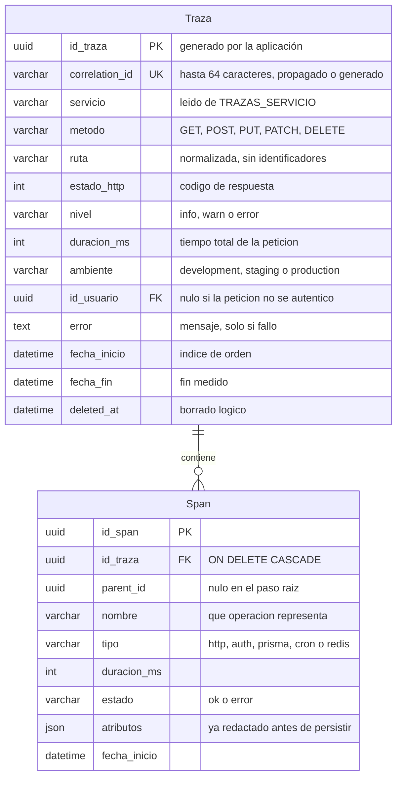

# Data Model: Trazas y Spans

**Feature**: `specs/006-visor-trazabilidad-logs-tracers/`
**Branch**: `feat/204-feature-implementar-visor-de-trazabilidad-con-logs-y-tracers`
**Date**: 2026-09-27

> Fuente de verdad del modelo: el esquema de Prisma en
> `goblinhub-api/prisma/schema.prisma`. Este documento fija los campos, sus tipos,
> sus restricciones y las reglas de validación que aplican los DTO y los casos de
> uso. Cualquier cambio aquí exige migración revisada (Principio III).

## Panorama

Dos entidades y una relación de Containment: una **Traza** es una petición completa
y sus **Spans** son los pasos internos que la componen, con un padre opcional que
permite reconstruir el árbol.

## Entidad: Traza

Una fila por petición instrumentada. Es la unidad que el administrador filtra y
que el visor abre.

| Campo | Tipo | Nulo | Regla |
|---|---|---|---|
| `id_traza` | `UUID` | no | Clave primaria. La genera la aplicación, no la base de datos, porque la traza se escribe al final de la petición y el identificador debe existir desde el principio. |
| `correlation_id` | `VarChar(64)` | no | **Único**. Identificador devuelto en la respuesta. Debe caber en 64 caracteres porque ese es el tope que `FR-002` impone al valor recibido del cliente. |
| `servicio` | `VarChar(50)` | no | Nombre del proceso que emitió la traza, leído de `TRAZAS_SERVICIO`. Con un solo proceso el valor es constante; la columna existe para que la llegada de un segundo servicio no obligue a cambiar el contrato de consulta ni a reconstruir el histórico. |
| `metodo` | `VarChar(10)` | no | Verbo HTTP en mayúsculas. |
| `ruta` | `VarChar(200)` | no | Ruta **normalizada**: los segmentos que son identificadores se sustituyen por `:id`. Ver *Normalización de rutas*. |
| `estado_http` | `Int` | no | Código de respuesta. Guarda el valor real, incluidos los 4xx: un 401 es información de diagnóstico, no ruido. |
| `nivel` | `VarChar(10)` | no | `info`, `warn` o `error`, derivado de `estado_http` por `FR-016`. Es un enum de dominio cerrado, no texto libre. Se añade porque la issue pide definir niveles de log, y se fija en la fila en lugar de derivarlo en cada lectura para que el filtro por nivel pueda usar un índice. |
| `duracion_ms` | `Int` | no | Duración total en milisegundos enteros. Medida con reloj monotónico, nunca con reloj de pared, para que un ajuste de hora del sistema no produzca duraciones negativas. |
| `ambiente` | `VarChar(20)` | no | `development`, `staging` o `production`, leído de `DEPLOY_ENV`. |
| `id_usuario` | `UUID` | sí | Usuario autenticado. Es `nulo` en las rutas públicas y en las tareas programadas. Se guarda a propósito: es un dato de auditoría, no un secreto (`FR-018` no lo incluye en la lista de enmascarado). |
| `error` | `Text` | sí | Mensaje del fallo, solo si lo hubo. |
| `fecha_inicio` | `DateTime` | no | Momento de entrada de la petición. Es la columna por la que se ordena y se filtra por rango. |
| `fecha_fin` | `DateTime` | no | Momento de finalización. Permite verificar `fecha_fin - fecha_inicio == duracion_ms` en un test. |
| `deleted_at` | `DateTime` | sí | Borrado lógico, conforme a la norma del proyecto. La purga física es la excepción documentada en `FR-027`. |

### Índices

Cinco índices, cada uno dispuesto para un filtro distinto de la historia 3:

| Índice | Columnas | Filtro que sirve |
|---|---|---|
| `idx_trazas_correlation_id` | `correlation_id` (único) | `GET /traces/:correlationId` |
| `idx_trazas_fecha` | `fecha_inicio` | Listado por defecto y rango de fechas |
| `idx_trazas_error` | `estado_http`, `fecha_inicio` | Localizar errores por endpoint y periodo |
| `idx_trazas_ambiente` | `ambiente`, `fecha_inicio` | Distinguir el despliegue |
| `idx_trazas_servicio` | `servicio`, `fecha_inicio` | Acotar a un proceso concreto |

> No se usa `sort: Desc` en los índices: el generador de Prisma declara
> `previewFeatures = ["partialIndexes"]` y añadir una característica de vista
> previa sería un cambio en la configuración del generador que affecta a todo el
> proyecto. El orden descendente se aplica en la consulta.

### Normalización de rutas

Sin normalizar, cada identificador de recurso crea una fila y dispersa el índice:
`/events/550e8400-e29b-41d4-a716-446655440000` y
`/events/660f8400-e29b-41d4-a716-446655440000` serían dos rutas distintas. La
normalización sustituye por `:id` el segmento que:

1. tiene forma de UUID (`/^[0-9a-f]{8}-[0-9a-f]{4}-[0-9a-f]{4}-[0-9a-f]{4}-[0-9a-f]{12}$/i`), o
2. es puramente numérico, o
3. es un entero de 32 dígitos sin guiones, por si en el futuro aparece un
   identificador con ese formato.

La ruta normalizada es la que se persiste y la que se filtra. La ruta literal **no**
se guarda, para no dejar identificadores de recurso en la base de datos
(`FR-020`).

## Entidad: Span

Un paso interno de la traza. Su árbol se reconstruye con `parent_id`.

| Campo | Tipo | Nulo | Regla |
|---|---|---|---|
| `id_span` | `UUID` | no | Clave primaria. |
| `id_traza` | `UUID` | no | Traza propietaria. El borrado es en cascada: no puede quedar un paso huérfano. |
| `parent_id` | `UUID` | sí | Padre en el árbol. `nulo` en el paso raíz. Un span cuyo padre no pertenece a la misma traza se considera inválido y se trata como raíz. |
| `nombre` | `VarChar(120)` | no | Operación, por ejemplo `validar token` o `consultar evento`. |
| `tipo` | `VarChar(30)` | no | Uno de `http`, `auth`, `prisma`, `cron` o `redis`. Es un enum de dominio cerrado, no texto libre. |
| `duracion_ms` | `Int` | no | Duración propia del paso, siempre menor o igual que la de la traza. |
| `estado` | `VarChar(20)` | no | `ok` o `error`. Determina si el visor lo distingue visualmente. |
| `atributos` | `Json` | sí | Detalles adicionales, **ya redactados** por `RedactionService` antes de llegar aquí. Nunca se persiste sin pasar por el servicio de redacción. |
| `fecha_inicio` | `DateTime` | no | Offset respecto a la traza, para que el visor pueda colocar la barra. |

### Índices

| Índice | Columnas | Para qué |
|---|---|---|
| `idx_spans_traza` | `id_traza` | Cargar los pasos de una traza en una sola consulta |
| `idx_spans_traza_padre` | `id_traza`, `parent_id` | Reconstruir el árbol sin cargar todos los pasos en memoria |

## Reglas de validación de los filtros

`FR-014` exige que los parámetros se validen con `class-validator` bajo el
`ValidationPipe` global con `whitelist: true` y `forbidNonWhitelisted: true`, de
modo que un parámetro desconocido es un `400` y no se ignora en silencio.

| Parámetro | Tipo | Por defecto | Rango | Regla |
|---|---|---|---|---|
| `page` | entero | `1` | `>= 1` | Comienza en uno, no en cero. |
| `limit` | entero | `50` | `1` a `200` | Fuera de rango se **acota**, no se rechaza, para no romper la navegación del visor. |
| `servicio` | texto | — | hasta 50 | Coincidencia exacta sobre el valor de `TRAZAS_SERVICIO`. |
| `metodo` | texto | — | Verbo HTTP | Se normaliza a mayúsculas. |
| `ruta` | texto | — | hasta 200 | Coincidencia por prefijo, sobre la ruta ya normalizada. |
| `estado` | entero | — | `100` a `599` | Permite filtrar por una clase completa si se pasa un valor con la misma semántica que el código. |
| `ambiente` | texto | — | catálogo de entornos | Se compara con `DEPLOY_ENV`; un valor fuera del catálogo devuelve la lista vacía, no un error. |
| `correlationId` | texto | — | hasta 64 | Coincidencia exacta. |
| `usuarioId` | texto | — | UUID | Coincidencia exacta. |
| `desde`, `hasta` | fecha | — | ISO 8601 | Si `desde` es posterior a `hasta`, el resultado es una lista vacía con `200`, no un `400`. |
| `minDuracion` | entero | — | `>= 0` | Milisegundos. |
| `includeTotal` | booleano | `false` | — | Permite omitir el `COUNT`, que en una tabla grande es la parte cara de la consulta. |

## Estados y transiciones

La traza no tiene máquina de estados: se escribe una vez, al final de la
petición, con el estado que resulted de la ejecución. No hay transiciones porque no
hay edición posterior.

El `estado` de un span, en cambio, se fija al cerrarlo y no cambia.

## Retención y volumen

Las trazas viven en la base de datos de negocio, así que el volumen es un riesgo
de primer orden. Los mecanismos que lo acotan, todos configurables por entorno:

| Variable | Por defecto | Efecto |
|---|---|---|
| `TRAZAS_ENABLED` | `true` | Si es `false`, no se instrumenta nada y el servicio sigue respondiendo con normalidad. |
| `TRAZAS_SERVICIO` | `goblinhub-api` | Nombre del proceso que emite la traza. Un valor vacío usa el valor por defecto. |
| `TRAZAS_NIVEL_MINIMO` | `info` | Nivel a partir del cual se persiste una traza. Con `warn` o `error` las peticiones correctas de nivel inferior no se guardan; los errores se persisten **siempre**, con independencia del nivel configurado. Un valor fuera del catálogo usa `info` y deja un aviso en el log. |
| `TRAZAS_RETENCION_DIAS` | `7` | Días que se conservan antes de la purga. Un valor no numérico o fuera de rango usa el valor por defecto y deja un aviso en el log, en vez de impedir el arranque. |

`DEPLOY_ENV` **no se define aquí**: la introduce el módulo de métricas de
`specs/005-modulo-metricas-monitoreo` con su catálogo de valores admitidos. Este
módulo lo lee y lo valida contra el mismo catálogo, y una prueba verifica que ambas
listas siguen sincronizadas, para que una modificación en un módulo rompa la
prueba del otro en lugar de producir una etiqueta de entorno inválida en silencio.

## Seguridad de los datos

- **Redacción antes de escribir** (`FR-017`): `RedactionService` sustituye por un
  marcador el valor de las claves que pueden contener secretos y trunca los textos
  largos. Se aplica a los `atributos` del span y a cualquier campo libre antes de
  la llamada a Prisma, nunca al leer.
- **Lo que sí se guarda a propósito**: `id_usuario` y `ip_address` no se enmascaran.
  Son datos de auditoría, y sin ellos una traza no permite atribuir una acción,
  que es justo lo que se necesita para diagnosticar una incidencia.
- **Lo que nunca se guarda**: el cuerpo de la petición y el de la respuesta
  (`FR-021`), ni el valor de las cabeceras de autorización, ni las variables de
  entorno, ni las claves de Supabase.
- **Acceso**: solo el rol `admin` puede leer trazas, con los mismos guards que ya
  protegen `LogController`. Una traza puede contener identificadores de usuario y
  rutas internas, de modo que exponerla a `empleado` o `jugador` sería una fuga.
